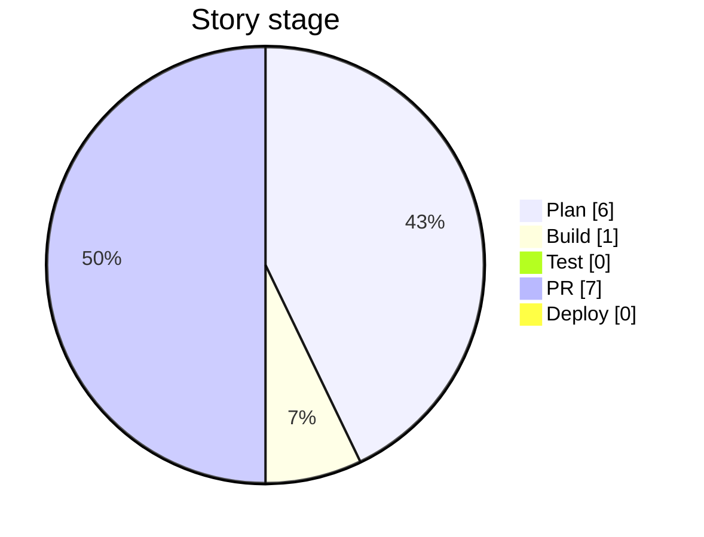

# Task Management API — Project Dashboard

> **Generated 2026-08-26** from the story backlog. Do not edit by hand — run `/pm-dashboard` (or `node scripts/pm/generate-dashboard.mjs`) to refresh. Stages follow this project's SDLC — see [SDLC.md](SDLC.md).

## Overall progress

- **By story count:** 0 of 14 delivered (Deploy or Archived) — **0%**  `░░░░░░░░░░░░░░░░░░░░`
- **By effort (size points):** 0 of 32 pts — **0%**  `░░░░░░░░░░░░░░░░░░░░`
- **Plan:** 6 · **Build:** 1 · **Test:** 0 · **PR:** 7 · **Deploy:** 0 · **Archived:** 0 (excluded from totals)

## Progress by epic

| Epic | Capability status | Deploy | PR | Test | Build | Plan | % (effort) | |
|------|-------------------|-------:|---:|-----:|------:|-----:|-----------:|--|
| Auth Enhancements | Not started | 0 | 0 | 0 | 0 | 3 | 0% | `░░░░░░░░░░░░` |
| Task Query Enhancements | Not started | 0 | 0 | 0 | 0 | 3 | 0% | `░░░░░░░░░░░░` |
| Docker & Deploy Infrastructure | In progress | 0 | 3 | 0 | 0 | 0 | 0% | `░░░░░░░░░░░░` |
| CI Pipeline | In progress | 0 | 2 | 0 | 1 | 0 | 0% | `░░░░░░░░░░░░` |
| Project Process Adoption | In progress | 0 | 2 | 0 | 0 | 0 | 0% | `░░░░░░░░░░░░` |

## Now — in progress (Build / Test / PR)

- **Enable branch protection requiring CI to pass before merge** — _CI Pipeline_ · S · stage: build
- **Add multi-stage Dockerfile and .dockerignore** — _Docker & Deploy Infrastructure_ · M · stage: pr
- **Add docker-compose base + dev/test/prod overrides** — _Docker & Deploy Infrastructure_ · M · stage: pr
- **Document Docker workflows in docs/setup.md and README** — _Docker & Deploy Infrastructure_ · S · stage: pr
- **Add GitHub Actions CI workflow (lint/test/build)** — _CI Pipeline_ · S · stage: pr
- **Add Docker image build/smoke-test job to CI** — _CI Pipeline_ · S · stage: pr
- **Adopt local Docket SDLC scaffolding (5-stage flow)** — _Project Process Adoption_ · L · stage: pr
- **Add story-advance skill and adapt generation scripts for 6-folder scheme** — _Project Process Adoption_ · M · stage: pr

## Next — top of the Plan backlog

- Add JWT refresh token endpoint — _Auth Enhancements_ · M · priority: high
- Add pagination to task list endpoints — _Task Query Enhancements_ · M · priority: high
- Support multiple concurrent refresh tokens per user — _Auth Enhancements_ · M · priority: medium
- Revoke all sessions endpoint — _Auth Enhancements_ · S · priority: medium
- Add status/priority filtering to task list endpoints — _Task Query Enhancements_ · M · priority: medium
- Add sort ordering to task list endpoints — _Task Query Enhancements_ · S · priority: low

## Delivered — 0 in Deploy, 0 Archived

See [ROADMAP.md](ROADMAP.md) for the timeline and [How long stories actually take](#how-long-stories-actually-take).

## How long stories actually take

_Measured end-to-end, from Build start to Deploy._

_No delivered stories carry tracked start/deploy dates yet, so cycle-time calibration has no samples._
_As stories move through Build → Test → PR → Deploy with real dates, this table fills in and the roadmap estimates become empirical instead of default._

---

_Derived from `docs/stories/` + `docs/project/epics.md`._
