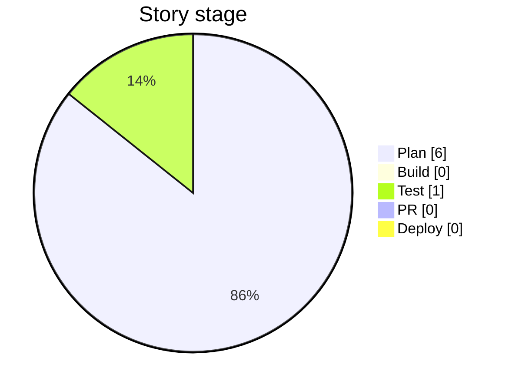
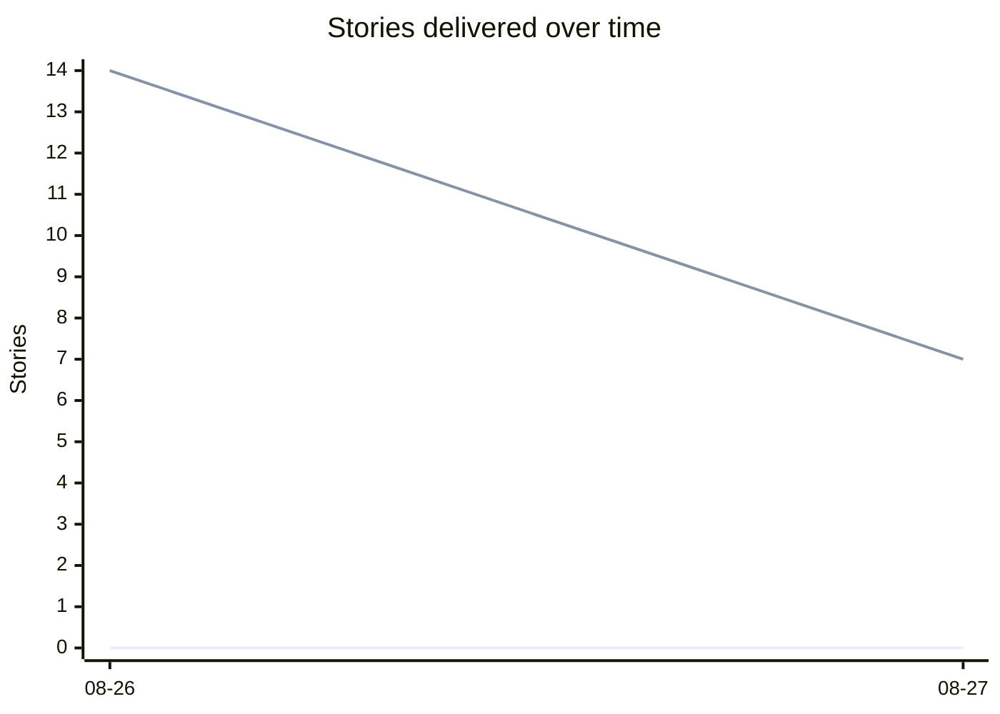

# Task Management API — Project Dashboard

> **Generated 2026-08-27** from the story backlog. Do not edit by hand — run `/pm-dashboard` (or `node scripts/pm/generate-dashboard.mjs`) to refresh. Stages follow this project's SDLC — see [SDLC.md](SDLC.md).

## Overall progress

- **By story count:** 0 of 7 delivered (Deploy or Archived) — **0%**  `░░░░░░░░░░░░░░░░░░░░`
- **By effort (size points):** 0 of 15 pts — **0%**  `░░░░░░░░░░░░░░░░░░░░`
- **Plan:** 6 · **Build:** 0 · **Test:** 1 · **PR:** 0 · **Deploy:** 0 · **Archived:** 7 (excluded from totals)

## Burn-up

## Progress by epic

| Epic | Capability status | Deploy | PR | Test | Build | Plan | % (effort) | |
|------|-------------------|-------:|---:|-----:|------:|-----:|-----------:|--|
| Auth Enhancements | Not started | 0 | 0 | 0 | 0 | 3 | 0% | `░░░░░░░░░░░░` |
| Task Query Enhancements | Not started | 0 | 0 | 0 | 0 | 3 | 0% | `░░░░░░░░░░░░` |
| Docker & Deploy Infrastructure | Done | 0 | 0 | 0 | 0 | 0 | 0% | `░░░░░░░░░░░░` |
| CI Pipeline | In progress | 0 | 0 | 1 | 0 | 0 | 0% | `░░░░░░░░░░░░` |
| Project Process Adoption | Done | 0 | 0 | 0 | 0 | 0 | 0% | `░░░░░░░░░░░░` |

## Now — in progress (Build / Test / PR)

- **Enable branch protection requiring CI to pass before merge** — _CI Pipeline_ · S · stage: test

## Next — top of the Plan backlog

- Add JWT refresh token endpoint — _Auth Enhancements_ · M · priority: high
- Add pagination to task list endpoints — _Task Query Enhancements_ · M · priority: high
- Support multiple concurrent refresh tokens per user — _Auth Enhancements_ · M · priority: medium
- Revoke all sessions endpoint — _Auth Enhancements_ · S · priority: medium
- Add status/priority filtering to task list endpoints — _Task Query Enhancements_ · M · priority: medium
- Add sort ordering to task list endpoints — _Task Query Enhancements_ · S · priority: low

## Delivered — 0 in Deploy, 7 Archived

See [ROADMAP.md](ROADMAP.md) for the timeline and [How long stories actually take](#how-long-stories-actually-take).

## How long stories actually take

_Measured end-to-end, from Build start to Deploy._

| Size | Points (baseline) | Samples | Median days | Mean | Min | Max | Days/point | Basis |
|------|------------------:|--------:|------------:|-----:|----:|----:|-----------:|-------|
| S | 1 | 3 | 0 | 0 | 0 | 0 | 0 | observed |
| M | 3 | 3 | 0 | 0 | 0 | 0 | 0 | observed |
| L | 5 | 1 | 0 | 0 | 0 | 0 | 1 | default |
| XL | 8 | 0 | — | — | — | — | 1 | default |

_Only stories with observed (`exact`) dates are counted; backfilled (`approx`) dates are excluded so estimates stay honest. A size switches from default to observed once it has ≥3 samples. **Days/point** is the story-point estimation baseline: it starts at the flat one-day-per-point assumption and recalibrates to the observed ratio (median days ÷ baseline points) as real `started`/`deployed` dates accumulate. Use it to sanity-check the `size:` you assign to a new story._

---

_Derived from `docs/stories/` + `docs/project/epics.md`._
