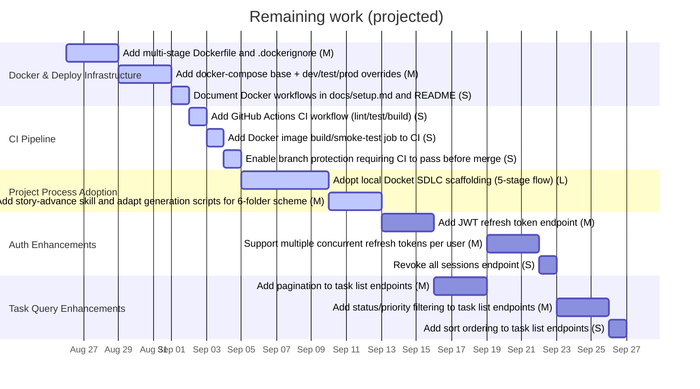

# Task Management API — Roadmap & Timeline

> **Generated 2026-08-26.** Delivered work with tracked dates is shown on the timeline; remaining work is projected forward. Do not edit by hand.

## Business capability status

| Capability status | Epics |
|-------------------|-------|
| Not started | Auth Enhancements, Task Query Enhancements |
| In progress | Docker & Deploy Infrastructure, CI Pipeline, Project Process Adoption |

## Forward plan

> **Basis:** durations are **default** point-per-day estimates (no delivered stories have tracked dates yet). Single-team sequential assumption starting 2026-08-26. This is a projection, not a commitment.

## Delivered timeline (tracked dates only)

_No delivered stories have tracked start/deploy dates yet. Once stories move through the folders with real dates recorded, they appear here on the timeline and feed the cycle-time calibration._

---

_Forward estimates self-calibrate: as delivered stories accrue real dates, per-size durations shift from default to observed. See DASHBOARD "How long stories actually take"._
