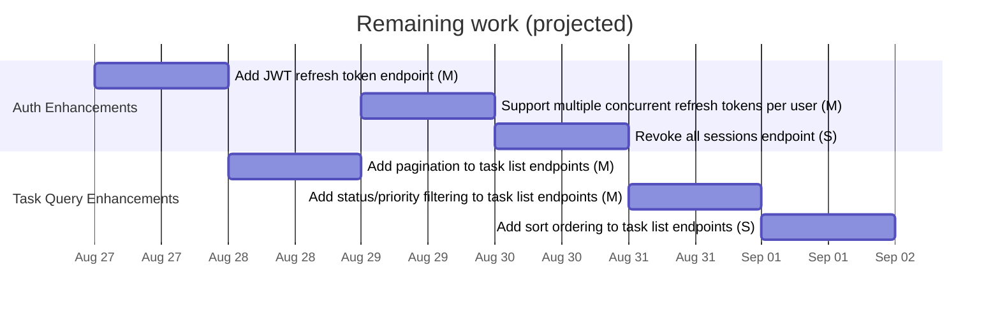
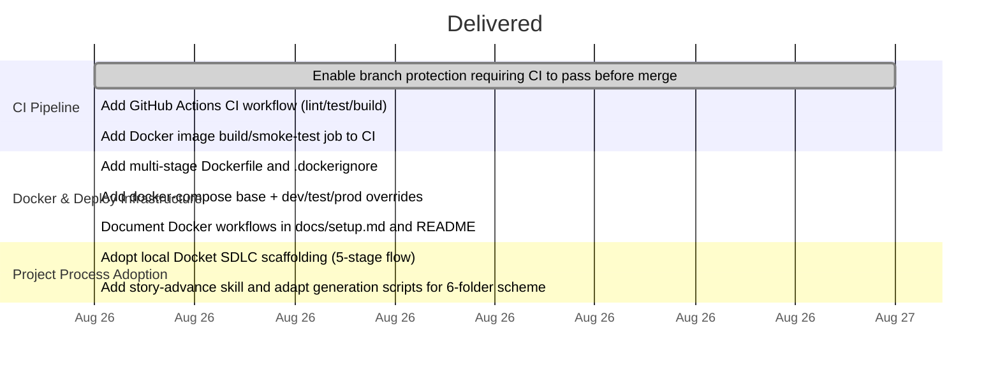

# Task Management API — Roadmap & Timeline

> **Generated 2026-08-27.** Delivered work with tracked dates is shown on the timeline; remaining work is projected forward. Do not edit by hand.

## Business capability status

| Capability status | Epics |
|-------------------|-------|
| Not started | Auth Enhancements, Task Query Enhancements |
| Done | Docker & Deploy Infrastructure, Project Process Adoption |
| In progress | CI Pipeline |

## Forward plan

> **Basis:** durations are a mix of **observed** cycle times (from delivered stories) and defaults where samples are thin. Single-team sequential assumption starting 2026-08-27. This is a projection, not a commitment.

## Delivered timeline (tracked dates only)

---

_Forward estimates self-calibrate: as delivered stories accrue real dates, per-size durations shift from default to observed. See DASHBOARD "How long stories actually take"._
